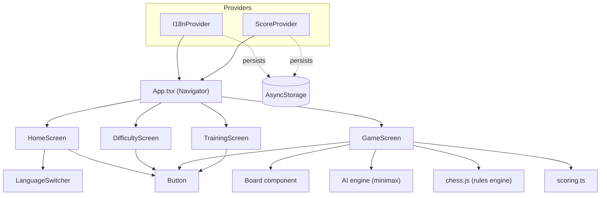
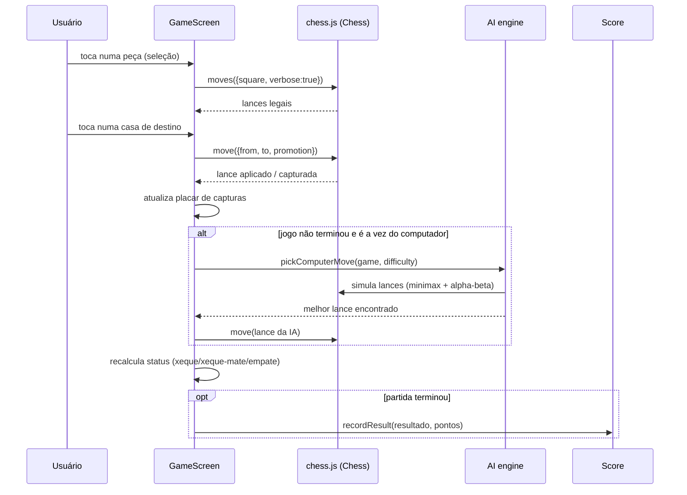
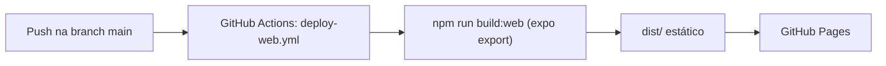

# Arquitetura do Sistema — ChessMaster

## 1. Visão geral

ChessMaster é uma aplicação **React Native + React Native Web**, gerenciada
pelo Expo, com uma única base de código compilada para dois alvos:

- **App móvel**, executado no Expo Go (ou em um build nativo).
- **Site web estático**, exportado com `expo export --platform web` e
  publicado no GitHub Pages via GitHub Actions.

Não há backend: toda a lógica de jogo roda no cliente e a persistência
(idioma escolhido e pontuação) usa armazenamento local do dispositivo ou do
navegador, através do `@react-native-async-storage/async-storage`.

## 2. Diagrama de componentes



## 3. Fluxo de uma partida contra o computador



## 4. Módulos principais

| Módulo | Responsabilidade |
|--------|-------------------|
| `src/i18n` | Dicionários de tradução (EN/PT/RU) e contexto de idioma persistido. |
| `src/chess/pieceValues.ts` | Valores de material das peças, compartilhados entre IA e pontuação. |
| `src/chess/glyphs.ts` | Glifos Unicode usados para desenhar as peças. |
| `src/chess/scoring.ts` | Cálculo de pontos ganhos ao final de uma partida. |
| `src/ai/engine.ts` | Algoritmo minimax com poda alfa-beta e três níveis de dificuldade. |
| `src/context/ScoreContext.tsx` | Estado global do placar, persistido via AsyncStorage. |
| `src/components/Board.tsx` | Renderização do tabuleiro 8x8 e interação de toque. |
| `src/components/Button.tsx`, `LanguageSwitcher.tsx` | Componentes de UI reutilizáveis. |
| `src/screens/*` | Telas: início, escolha de dificuldade, partida e treino. |
| `App.tsx` | Provedores globais (idioma, placar) e navegação simples baseada em estado. |

## 5. Motor de regras e motor de IA

- **Regras do jogo**: delegadas à biblioteca `chess.js`, responsável por
  geração de lances legais, detecção de xeque/xeque-mate/afogamento/empate,
  roque, *en passant* e promoção.
- **Inteligência artificial**: implementada em `src/ai/engine.ts` com um
  algoritmo minimax com poda alfa-beta, ordenação de lances priorizando
  capturas, e avaliação de tabuleiro por valor de material.
  - **Fácil**: alta chance de jogar um lance aleatório, com profundidade de
    busca rasa quando joga "a sério".
  - **Intermediário**: busca com profundidade 2.
  - **Difícil**: busca com profundidade 3.

## 6. Publicação web (GitHub Pages)



O `app.json` define `experiments.baseUrl: "/ChessMaster"`, garantindo que
os caminhos dos assets funcionem corretamente quando o site é servido a
partir de `https://<usuário>.github.io/ChessMaster/` (site de projeto, não
de organização).

## 7. Estrutura de pastas

```
ChessMaster/
├── App.tsx                # Ponto de entrada e navegação
├── src/
│   ├── ai/                # Motor de IA (minimax)
│   ├── chess/              # Utilidades de xadrez (valores, glifos, pontuação)
│   ├── components/         # Componentes de UI reutilizáveis
│   ├── context/            # Contexto de pontuação
│   ├── i18n/                # Traduções e contexto de idioma
│   ├── screens/             # Telas do aplicativo
│   └── theme/               # Paleta de cores
├── docs/                   # Documentação do produto (este conjunto de arquivos)
└── .github/workflows/       # Automação de build/deploy do site
```
