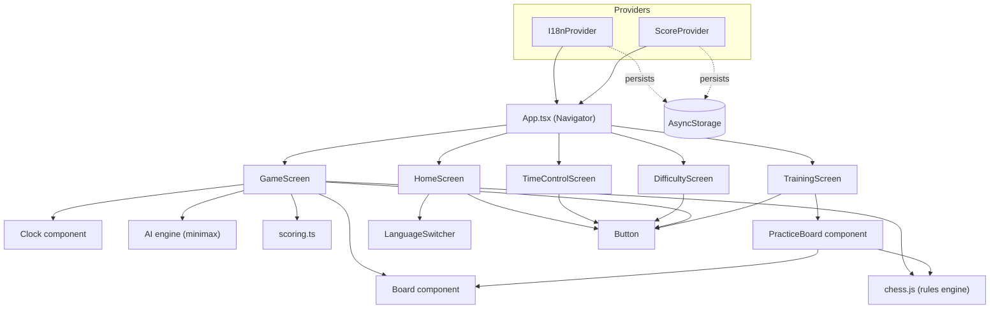
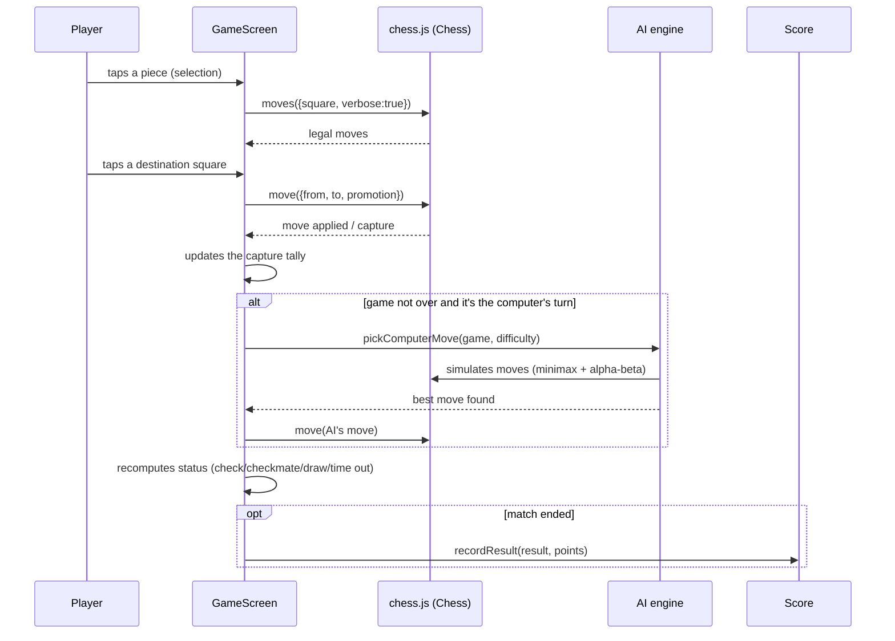
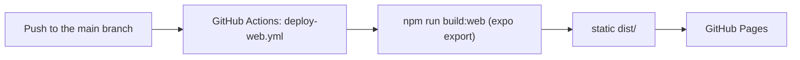

# System Architecture — ChessMaster

## 1. Overview

ChessMaster is a **React Native + React Native Web** application, managed
by Expo, with a single codebase compiled for two targets:

- A **mobile app**, run through Expo Go (or a native build).
- A **static website**, exported with `expo export --platform web` and
  published on GitHub Pages through GitHub Actions.

There is no backend: all game logic runs on the client, and persistence
(chosen language and score) uses the device's or browser's local storage,
through `@react-native-async-storage/async-storage`.

## 2. Component diagram



## 3. Flow of a match against the computer



## 4. Main modules

| Module | Responsibility |
|--------|-----------------|
| `src/i18n` | Translation dictionaries (EN/PT/RU) and the persisted language context. |
| `src/chess/pieceValues.ts` | Piece material values, shared by the AI and the scoring logic. |
| `src/chess/glyphs.ts` | Unicode glyphs used to draw the pieces. |
| `src/chess/scoring.ts` | Points-earned calculation at the end of a match. |
| `src/ai/engine.ts` | Minimax algorithm with alpha-beta pruning and three difficulty levels. |
| `src/context/ScoreContext.tsx` | Global score state, persisted via AsyncStorage. |
| `src/components/Board.tsx` | Renders the 8x8 board and handles tap interaction. |
| `src/components/Clock.tsx` | Renders one player's remaining time, highlighting the active side. |
| `src/components/PracticeBoard.tsx` | Stakes-free board for Training mode; lets either color be selected out of turn via `chess.js`'s `setTurn()`. |
| `src/components/Button.tsx`, `LanguageSwitcher.tsx` | Reusable UI components. |
| `src/screens/*` | Screens: home, time control, difficulty picker, match, training. |
| `App.tsx` | Global providers (language, score) and simple state-based navigation. |

## 5. Rules engine and AI engine

- **Game rules**: delegated to the `chess.js` library, responsible for
  legal move generation, check/checkmate/stalemate/draw detection,
  castling, en passant and promotion.
- **Artificial intelligence**: implemented in `src/ai/engine.ts` with a
  minimax algorithm with alpha-beta pruning, move ordering that
  prioritizes captures, and board evaluation by material value.
  - **Easy**: high chance of playing a random move, with a shallow search
    depth when it does "play seriously".
  - **Medium**: search at depth 2.
  - **Hard**: search at depth 3.

## 6. Chess clocks

Each match can be started with a time control (3, 5 or 10 minutes per
side, or no limit), chosen on `TimeControlScreen` before the match begins.
`GameScreen` keeps each side's remaining time in state and decrements the
active side's clock based on elapsed wall-clock time (not a fixed tick),
so it stays accurate even if the JS timer is throttled. When a clock
reaches zero, the match ends immediately as a timeout, scored the same way
a checkmate result would be.

## 7. Web publishing (GitHub Pages)



`app.json` sets `experiments.baseUrl: "/ChessMaster"`, ensuring asset paths
resolve correctly when the site is served from
`https://<username>.github.io/ChessMaster/` (a project site, not an
organization/user site).

## 8. Folder structure

```
ChessMaster/
├── App.tsx                 # Entry point and navigation
├── src/
│   ├── ai/                 # AI engine (minimax)
│   ├── chess/               # Chess utilities (values, glyphs, scoring)
│   ├── components/          # Reusable UI components
│   ├── context/              # Score context
│   ├── i18n/                  # Translations and language context
│   ├── screens/               # App screens
│   └── theme/                  # Color palette
├── docs/                    # Product documentation (this file set)
└── .github/workflows/        # Web build/deploy automation
```
